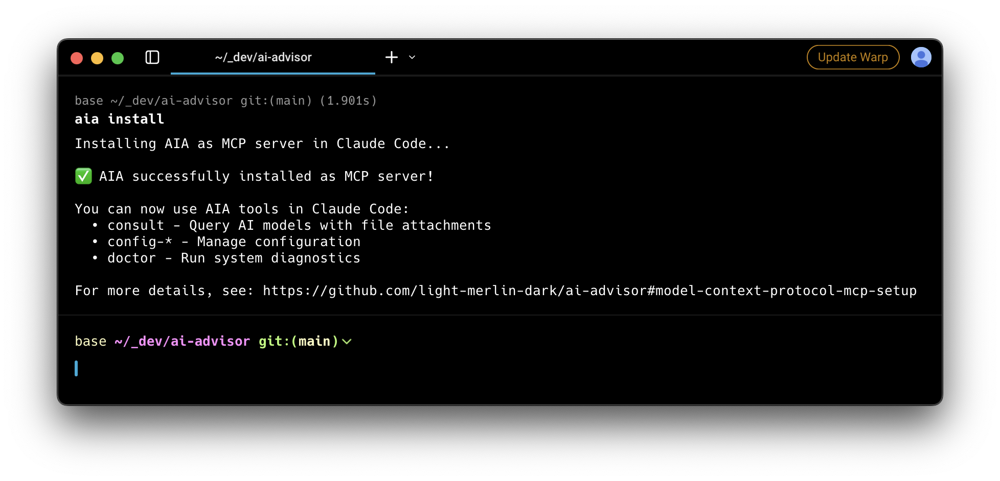

# AIA

**The Model Context Protocol (MCP) for parallel AI consultation.**

Built from the ground up for seamless integration with Claude Code, Claude Desktop, and other AI tools that support MCP. AIA transforms how AI agents and developers consult multiple AI models by providing parallel queries, intelligent retry mechanisms, and a powerful plugin architecture.



## 🚀 Why AIA?

### Native MCP Integration
AIA is a first-class MCP tool, meaning AI agents can:
- Query multiple AI models simultaneously with a single command
- Attach files and directories without reading them first (saves context)
- Get JSON-structured responses optimized for agent consumption
- Benefit from automatic retry and failover mechanisms

### Parallel AI Consultation
Query multiple AI models at once:
- Compare responses from GPT-4, Claude, and other models side-by-side
- Get diverse perspectives on complex technical challenges
- Save time with concurrent model queries
- Optional best-of selection for critical decisions

### Plugin Architecture
Extend AIA with provider plugins:
- **OpenAI Plugin**: O3-mini, GPT-4, GPT-3.5-turbo, and more
- **Anthropic Plugin**: Claude Sonnet 4, Claude Opus 4, Claude 3 models
- **OpenRouter Plugin**: Access to 50+ models through one API
- **Custom Plugins**: Build your own for specific AI services

## 🔌 Model Context Protocol (MCP) Setup

### Quick Start with Claude Code
```bash
# Install AIA globally
npm install -g @light-merlin-dark/aia

# Install as MCP server in Claude Code
aia install
```

### Available MCP Tools
Once configured, AI agents gain access to powerful tools:

#### Core AI Tools
- `consult` - Query multiple AI models with optional file attachments
  - Supports parallel model consultation
  - File and directory attachment for context
  - Optional best-of selection mode
  - JSON-structured responses with cost tracking

#### Configuration Management
- `config-list` - List all configuration (with masked secrets)
- `config-get` - Get configuration for specific services
- `config-set` - Set configuration values
- `config-remove` - Remove services from configuration

#### Model & Pricing Management
- `config-add-model` - Add models to services
- `config-set-default` - Set default model
- `config-set-default-service` - Set default service for bare model names
- `config-clear-default` - Clear default model
- `config-set-pricing` - Configure input/output costs per model
- `config-get-pricing` - View pricing information
- `config-remove-pricing` - Remove pricing configuration

#### Backup & Recovery
- `config-backup` - Backup configuration with optional name
- `config-restore` - Restore from backup
- `config-list-backups` - List available backups
- `config-clear` - Clear all configuration (with confirmation)

#### Diagnostics & Logs
- `config-view-logs` - View server logs with filtering
  - Filter by log level (ERROR, WARN, INFO, DEBUG)
  - Search for specific text
  - View logs from specific dates
  - Control number of lines returned
- `doctor` - Comprehensive system diagnostics
  - System information and health checks
  - Configuration overview with recommendations
  - Plugin status and recent log summary

## ✨ Key Features

### 🤖 AI-Optimized Output
```json
{
  "responses": [
    {
      "model": "o3-mini",
      "provider": "openai",
      "content": "...",
      "usage": {
        "promptTokens": 150,
        "completionTokens": 350,
        "totalTokens": 500
      }
    },
    {
      "model": "claude-sonnet-4-20250514",
      "provider": "anthropic",
      "content": "...",
      "usage": {
        "promptTokens": 150,
        "completionTokens": 425,
        "totalTokens": 575
      }
    }
  ],
  "failed": [],
  "durationMs": 3456,
  "bestIndex": 0,  // Only if bestOf=true
  "costs": [
    {
      "model": "o3-mini",
      "promptCost": 0.000165,
      "completionCost": 0.00154,
      "totalCost": 0.001705
    },
    {
      "model": "claude-sonnet-4-20250514",
      "promptCost": 0.00045,
      "completionCost": 0.006375,
      "totalCost": 0.006825
    }
  ],
  "totalCost": 0.00853
}
```

### 🎯 Intelligent File Resolution
Advanced file handling for AI agents:
- Automatic working directory detection
- Relative and absolute path support
- Size-aware file reading (40KB default limit)
- Directory traversal with filtering
- Clear truncation warnings

### 🛡️ Enterprise-Ready Reliability
- Automatic retry with exponential backoff (2 attempts)
- Intelligent failover to next available model
- Configurable timeouts (60s first attempt, 90s retry)
- Comprehensive error tracking and logging

### 💰 Cost Tracking
Real-time cost calculation for all API calls:
- Automatic token counting using actual API usage data
- Fallback token estimation for providers without usage data
- Per-model cost breakdown with formatted display
- Total cost aggregation for multi-model queries
- Configure pricing during setup or via CLI commands

```bash
# Configure pricing
aia services cost set openai gpt-4-turbo --input 10 --output 30

# List all configured pricing
aia services cost list

# Remove pricing configuration
aia services cost remove openai gpt-4-turbo
```

Cost display in responses:
```
=== gpt-4-turbo ===
[Response content...]

Cost: $0.0125 (150 in, 350 out)
```

### 🔐 Secure Configuration
Interactive setup with encrypted credential storage:
```bash
aia consult "test"  # Launches setup wizard on first run
```

The streamlined setup will:
1. Present a simple service selection menu
2. Accept model string directly (e.g., "o3", "claude-3-opus-20240229")
3. Securely input API keys
4. Optionally configure pricing for cost tracking ($/M tokens)
5. Encrypt and save configuration (AES-256-GCM)

## 📦 Installation

```bash
# Install globally via npm
npm install -g @light-merlin-dark/aia

# First run launches setup automatically
aia consult "Hello AI!"
```

### Prerequisites
- Node.js 18.0.0 or higher
- API keys for desired AI providers
- Optional: MCP-compatible AI tools

## 🚀 Quick Start

### CLI Usage

```bash
# View help and examples
aia --help

# Single model consultation (uses default)
aia consult "Refactor this code for better performance" -f src/index.ts

# Multi-model consultation
aia consult "Design a caching strategy" -m gpt-4-turbo claude-3-opus

# With best-of selection
aia consult "Complex architecture question" -m gpt-4 claude-3 --best-of

# Attach multiple files
aia consult "Review this implementation" -f src/api.ts src/types.ts

# Attach entire directories
aia consult "Analyze project structure" -d src/ tests/

# Short alias
aia c "Quick question"
```

### Service Management

```bash
# Manage services interactively
aia services

# Reset configuration
aia reset
aia reset --force  # Skip confirmation
```

### MCP Usage

The AI Advisor MCP server provides comprehensive tools for AI consultation and system management.

**Core Consultation:**
```json
{
  "prompt": "Review this code for security issues",
  "files": ["src/auth.ts"],
  "models": ["gpt-4-turbo", "claude-3-opus"],
  "output": "security-review.json"
}
```

**Configuration Management:**
```json
{
  "service": "openai",
  "model": "gpt-4",
  "inputCost": 10,
  "outputCost": 30
}
```

**System Diagnostics:**
```json
{
  "lines": 100,
  "level": "ERROR",
  "search": "timeout"
}
```

**Key Features:**
- Query multiple AI models in parallel
- Complete configuration management
- Real-time cost tracking with custom pricing
- Advanced log viewing and search
- Comprehensive system diagnostics
- Backup and recovery operations
- Automatic retry and failover

**Common Use Cases:**
- Code reviews and security audits
- Architecture decisions with cost analysis
- System troubleshooting and log analysis
- Configuration management and backup
- Multi-model performance comparison

For comprehensive usage examples and best practices, see the [MCP Usage Guide](docs/mcp-usage-guide.md).

## 🧩 Plugin System

AIA features a powerful plugin architecture for AI provider integration.

### Built-in Plugins

- **OpenAI**: Access to O3-mini, GPT-4, GPT-4 Turbo, GPT-3.5-turbo
- **Anthropic**: Claude Sonnet 4, Claude Opus 4, Claude 3 models
- **OpenRouter**: Gateway to 50+ models including Google Gemini, Mixtral, and more

### Plugin Development

Creating an AIA plugin:

```typescript
import { AIProviderPlugin } from 'aia/types';

const myPlugin: AIProviderPlugin = {
  name: 'my-provider',
  version: '1.0.0',

  async listModels() {
    return ['model-1', 'model-2'];
  },

  async execute(model, prompt, options) {
    // Your API integration here
    return {
      content: response,
      metadata: { tokensUsed: 100 }
    };
  },

  validateConfig(config) {
    return !!config.apiKey;
  },

  getRequiredEnvVars() {
    return ['MY_PROVIDER_API_KEY'];
  }
};

export default myPlugin;
```

## 🎯 Perfect for AI Agent Workflows

### Why AI Agents Love AIA

1. **MCP Native**: First-class support for Model Context Protocol
2. **Context Efficient**: Attach files without reading them first
3. **Parallel Power**: Query multiple models in one go
4. **JSON Responses**: Structured output perfect for parsing
5. **Reliability**: Automatic retry and failover built-in
6. **Extensible**: Easy to add new AI providers

### Common Use Cases

```bash
# Code Review with Multiple Perspectives
aia consult "Review this PR for security issues" -d src/ -m gpt-4 claude-3-opus

# Architecture Decisions
aia consult "Compare microservices vs monolith for this use case" \
  -f requirements.md architecture.md -m gpt-4 claude-3 --best-of

# Debugging Complex Issues
aia consult "Why is this function returning undefined?" \
  -f buggy-function.js tests/function.test.js -m gpt-4-turbo claude-3

# Performance Optimization with OpenRouter models
aia consult "Optimize this SQL query" -f slow-query.sql \
  -m gpt-4 claude-3 openrouter/google/gemini-2.5-pro-preview
```

## ⚙️ Configuration

Configuration is stored encrypted in `~/.aia/config.enc`:

```json
{
  "services": {
    "openai": {
      "apiKey": "sk-...",
      "models": ["o3-mini"],
      "pricing": {
        "o3-mini": {
          "inputCostPerMillion": 1.1,
          "outputCostPerMillion": 4.4
        }
      }
    },
    "anthropic": {
      "apiKey": "sk-ant-...",
      "models": ["claude-sonnet-4-20250514"],
      "pricing": {
        "claude-sonnet-4-20250514": {
          "inputCostPerMillion": 3,
          "outputCostPerMillion": 15
        }
      }
    },
    "default": {
      "service": "anthropic"  // Default service when no models specified
    }
  },
  "maxRetries": 2,
  "timeout": 60000
}
```

**No Default Models**: AIA doesn't assume any default models. When you run `aia consult` without specifying models, it uses the models from your configured default service. If no default service is set, AIA will guide you through the setup wizard.

Environment variables (optional):
- `OPENAI_API_KEY` - OpenAI API key
- `ANTHROPIC_API_KEY` - Anthropic API key
- `OPENROUTER_API_KEY` - OpenRouter API key
- `AIA_CONFIG_DIR` - Custom config directory

## 🛡️ Security Features

- **Encrypted Storage**: AES-256-GCM encryption for credentials
- **Local Key Management**: Keys never leave your machine
- **Path Validation**: Protection against directory traversal
- **Input Sanitization**: Safe handling of user inputs
- **Rate Limiting**: Respects provider limits automatically

## 📊 Performance

Optimized for speed and efficiency:
- **Parallel Execution**: Concurrent model queries with Promise.allSettled
- **Connection Pooling**: Reused HTTP clients per provider
- **Lazy Loading**: Plugins loaded only when needed
- **Smart Timeouts**: 60s first attempt, 90s retry with backoff
- **Minimal Overhead**: <100ms orchestration overhead

## 🔧 Development

```bash
# Clone the repository
git clone https://github.com/light-merlin-dark/ai-advisor.git
cd ai-advisor

# Install dependencies
make install

# Run in development mode
make dev

# Run tests
make test

# Build for production
make build
```

### Development Workflow

```bash
# Common tasks
make lint        # Lint code
make test        # Run test suite (uses Bun test)
make test-unit   # Run unit tests only
make test-e2e    # Run e2e tests only
make build       # Build TypeScript
make clean       # Clean artifacts

# Release workflow
make push        # Prepare release
make release     # Publish to npm
```

## 📁 Project Structure

```
aia/
├── src/               # Core application code
├── plugins/           # Provider plugin implementations
├── scripts/           # Development automation
├── tests/             # Test suites
└── docs/              # Documentation
```

## License

MIT License - see [LICENSE](LICENSE) file for details.

## Contributing

Contributions are welcome! Please feel free to submit a Pull Request.

---

Built with ❤️ by [@EnchantedRobot](https://twitter.com/EnchantedRobot)
